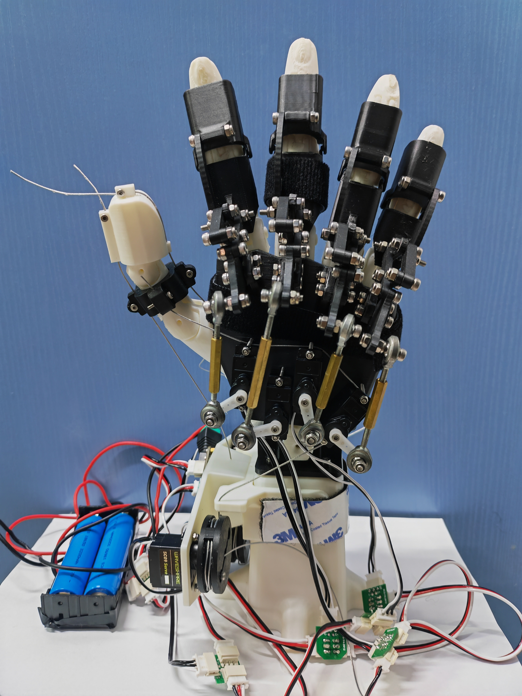
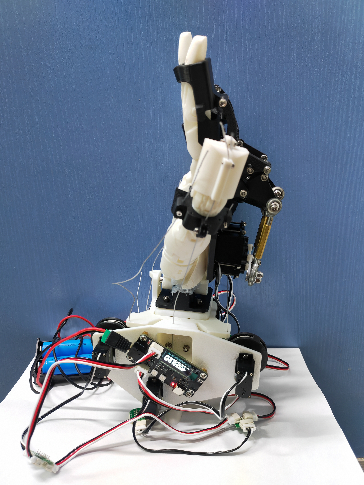
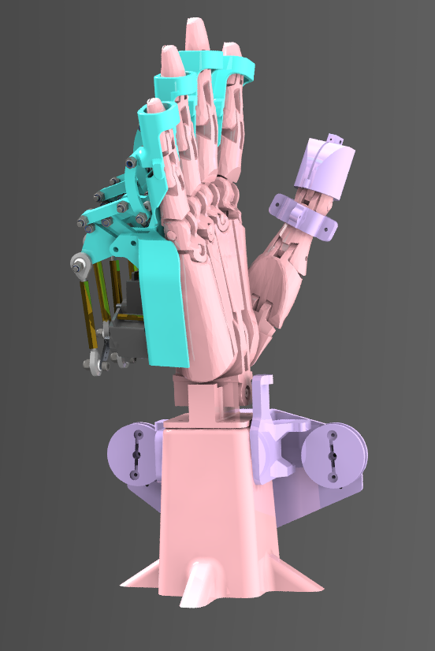
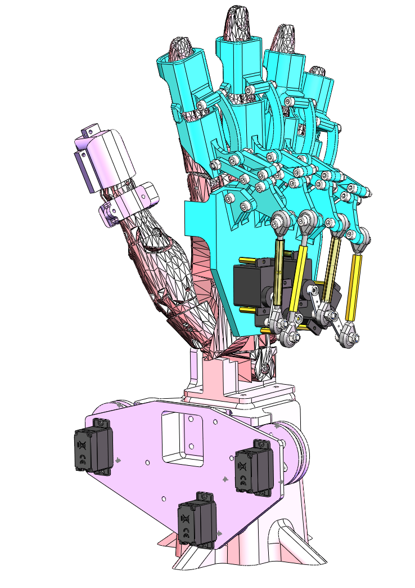
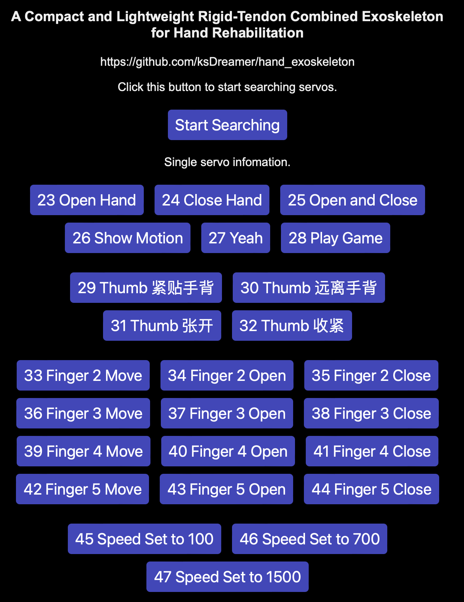

# hand_exoskeleton 机械手外骨骼

[toc]

A low-cost hand exoskeleton using linkage and tendon mechanism under ESP32.   

低成本手部外骨骼，连杆驱动四指，线驱模拟肌腱机制驱动大拇指，ESP32主控，使用SC09总线舵机。





## Getting Start 复现教程

1. 克隆仓库到本地，下载相关资源

```git clone https://github.com/ksDreamer/hand_exoskeleton.git```

2. 机械相关资源在mechanics文件夹里，需要修改就自行修改。完成后导出.3mf/.stl等3D打印格式文件，用切片软件处理后进行3D打印。可参考作者之前写的3D打印教程：[3D 打印机_拓竹 X1Carbon_操作指南](https://zhuanlan.zhihu.com/p/644491008)
3. 电控和软件相关资源在program文件夹里。需要完整下载ServoDriver文件夹。
4. 配置ESP32的Arduino开发环境：跟着微雪的[Servo Driver with ESP32用户手册](https://www.waveshare.net/w/upload/d/d6/Servo-Driver-with-ESP32-user-manual-cn.pdf)操作。重要的就是选择Board：ESP32 Dev Module。选择串口（不同不一定相同），注意Mac电脑的串口不叫COM，通常叫usbserial-0001
5. 连上ESP32和舵机后，用Type-C口烧录程序。保持供电。
6. 现在你可以在电脑/手机/平板等智能设备的Wi-Fi列表看到“ESP32_KevinStark"，密码是"88888888"（这些都是你可以自己设置的！），连接后就可以通过局域网访问ESP32 的IP 打开Web前端控制界面了。IP地址通常是[192.168.4.1](192.168.4.1)。（ESP32支持蓝牙、Wi-Fi、ESP-NOW三种通信方式，ESP-NOW可以做机械手的示教，有空再细写相关内容教程TD）
7. 设置舵机ID。因为买来新舵机默认ID都是1，所以需要给多个舵机分配不同的ID。通过Web界面的```ID Select+, ID Select-, ID to Set+, ID to Set-```四个按钮，或者手动烧程序来依次设置舵机ID。本项目的ID分配信息如下：大拇指从左往右1、2、3。四指从食指开始为4，小尾指为7。
8. 开始玩耍。

用Web前端交互可能会出现点击一次触发3下动作的问题，暂时不清楚为何。是多个事件监视器对上一个窗口？还是什么原因。

为稳妥，推荐在问题没找到和解决前用串口控制。

## Material 材料

* 机械相关
  * SC09 总线舵机 * 7 
  * 鱼眼轴承 M3 * 8 
  * M2和M3规格的螺丝和螺母若干，六角螺丝刀，十字螺丝刀。
  * 六角铜柱 *4（内径3.2mm，长度20-38mm不定，与鱼眼轴承给进配合和软件角度配合）
  * 线 0.8mm 
  * 3D打印（可考虑PLA耗材）
* 电子相关
  * ESP32 微控制器 *1 
  * 信号线和串线板（如果采用本项目列出的材料商家，会在每一份舵机包裹里配套这两个）
  * 供电
    * 查询[微雪ESP32的文档](https://www.waveshare.net/wiki/Servo_Driver_with_ESP32)可得知其工作电压为6-12V，接口为5.5*2.1mm DC。因此我们需要：
    * 支持DC6-12V供电的5521DC口电源
    * 或者2-3节18650电池串联（3.7v）5.5*2.1mm +5521DC转接头+电池座（后面有附制作过程）
  * 电线和锡丝若干
  * 电焊台
  * （可选）热风枪、热塑管、电源开关、
* 软件
  * 开发：推荐VSCode开发迭代，Arduino烧录
  * 设备：支持上传程序的电脑，已在Mac和Windows 上测试可行。ESP32烧录口是Type-C
  * 使用：任一能连接Wi-Fi且具有图形化窗口的设备

## Mechanics 机械介绍





### 基本信息

连杆与线驱结合控制。

重量：大拇指外骨骼174g，四指外骨骼226g，总重大约400g。（含舵机和各种零件耗材，不含手模型和电源）

尺寸：150x150x310mm

负载：四指总拉力>20N。

与手部贴合的部分采用圆角设计，具有良好的舒适性。

四指穿戴方便，直接往手上套。大拇指需要套环和拉线，会复杂一点。

### 四指——连杆


传动部分通过**曲柄连杆**与**鱼眼轴承**将水平面内的运动转化为手指的竖直运动，并限制摇杆的行程，保证安全性；
执行部分每根手指采用八根连杆的系统控制，考虑到MCP关节两侧没有地方穿戴外骨骼，故通过两个平行四边形四连杆将关节引出，PIP关节通过四连杆设计方式准确控制弯曲程度，并且进一步通过螺丝之间的干涉再次保证手指不会反向弯曲。  

### 大拇指——线驱

大拇指通过三个舵机实现两自由度的紧凑灵活过驱动线驱控制。

其中1号舵机和3号舵机控制一个轴的自由度，2号舵机控制水平面垂直另一个轴的自由度。

## Program 程序介绍

### 基本信息

单舵机控制：```st.WritePos(2, 450, 0,400);``` 第一项2表示舵机ID是2，第二项450表示目标角度为450，第四项400表示转动速度为400。第三项不用管。

多舵机同时控制，就把舵机ID、Position和Speed存入相应数组，```st.SyncWritePos(ID, 7, Position, 0, Speed);```分别是舵机ID，舵机数量，角度，第四项不用管，速度。

多舵机控制需要在STSCTRL.h 里定义```byte ID[]、u16 Position[]、u16 Speed[]```，方括号内填数量。

重要参考文档：

* https://www.waveshare.net/wiki/Servo_Driver_with_ESP32 

* https://www.waveshare.net/wiki/SC09_Servo

### ServoDriver.ino

ServoDriver.ino 是主程序，```void loop()```是主函数，在这里写的程序只要主控上电就会自动循环执行。

在 ```void setup()```里这几行的作用是初始化舵机，匹配舵机ID和计算机中的变量

```c++
  ID[0] = 1; //匹配舵机ID，大拇指分别为1,2,3,二到五指为4,5,6,7。有多少个就要在STSCTRL.h的byte ID[]，Position[]，Speed[]里对应修改。
  ID[1] = 2;
  ID[2] = 3;
  ID[3] = 4;
  ID[4] = 5;
  ID[5] = 6;
  ID[6] = 7;
```

只要有供电，就能在Wifi列表找到ESP32的局域网热点。连接后浏览器访问192.168.4.1可以打开web调试界面。（前提是没有把Wi-Fi相关程序注释或删除）

本程序里在```loop```里增加了串口调试的相关程序，方便开发测试。使用方法是：（设置好开发板环境、波特率等之后）Type-C连接电脑和ESP32，在Arduino右上角打开串口监视器。可以有两种输入：

* ```[ID] [Position] [Speed]```格式的单舵机转动命令，需要空格。

* ```[caseNumber]```格式的动作方案。

### CONNECT.h

在这里的```activeCtrl```里面的```switch case```添加想要的动作方案。例如case 23是写好了的```Open Hand```函数。

```c++
case 23: // Open Hand
        openHand();
        moveThumbSameTime(1000, 100, 0, setSpeed);
        break;
```

里面可以直接用前面介绍的```WritePos```等方法直接写你要的转动方案。此处的两个子函数是在外面做了函数定义和封装。查阅CONNECT.h即可查到其定义。

此处就可以做很多动作方案和软件开发相关工作了。如果感兴趣可以直接把微雪官方文件拉下来看看和本项目的有什么区别。

### WEBPAGE.h

WEBPAGE.h 是对Web前端界面的开发。本质是HTML+JavaScript+CSS。  



要给Web前端开发新功能，想要什么动作方案就在CONNECT.h里的```active Control```函数处添加新case，然后在WEBPAGE.h里调用```toggleCheckbox```函数。（建议从case 30开始，不建议和官方的case重叠覆盖）

例如看下面这个，就是添加了一个叫做“23 Open Hand”的按钮。点击就会触发```toggleCheckbox```函数里的第二个参数对应的case。那case 23是什么呢？就需要你自己去写了，本项目case 23 对应Open Hand

```html
<label align="center"><button class="button" onclick="toggleCheckbox(1, 23, 0, 0);">23 Open Hand</button></label>
```


此处就可以做很多网页前端相关工作了。如果感兴趣可以直接把微雪官方文件拉下来看看和本项目的有什么区别。

### 开发日志Developing Log

* v0.2 测试得到四指和大拇指2号舵机的合适转动角度，放在Loop主函数里。

* v0.3 WEB前端增加四指的Move、Open、Close按钮和动作方案。根据舵臂和装置测试效果重新调整小尾指（7号舵机）转动参数以避免干涉。修改Wifi名为ESP32_KevinStark，密码为88888888。

* v0.4 增加大拇指控制方案，先```relaxThumb```让1和3号舵机的线松驰，再移动；封装了很多函数，增强可维护性；增加了很多动作方案。

* v0.5 优化代码结构，封装函数。大拇指稳定，先张开再收紧。增加动作方案例如四指和大拇指的联动，play game 石头剪刀布。整理Web前端布局。于ServoDriver.ino增加串口调试程序，可接收"[ID] [Position] [Speed]"格式的单舵机转动命令，还有"[caseNumber]"格式的动作方案。

* v1.0 增加三种Speed的选择 100 700 1500 对应case 45 46 47，只改变四指运行速度。简化前端界面。

## 成本

要复现本项目，至少需要这些：

* SC09舵机 单价47元，7个，[微雪 SC09串行总线舵机300度转动角度金属齿轮舵机电机双模式切换](https://detail.tmall.com/item.htm?id=714639378997)

* ESP32开发板 单价80元，1个，[微雪 ESP32舵机驱动扩展板 wifi远程控制 蓝牙通信 支持253个舵机](https://detail.tmall.com/item.htm?id=667483395387)

* 鱼眼轴承 单价1.9元，8个，[气缸鱼眼接头关节轴承向心万向杆端球头SI内丝SA外螺纹连接杆拉杆](https://item.taobao.com/item.htm?id=725305319897)
* 线 单价2.89元，一次10米长，[304不锈钢钢丝绳 晾衣绳遮阳网包塑钢丝绳 细软小包胶钢丝绳 0.8mm](https://detail.tmall.com/item.htm?id=727898238439)

以上共需要427.09元。

还有机械、3D打印、电焊的耗材和工具，还有供电。还有运费。

电池+焊接一整套大概在30元以内，3D打印应该是30元以内（仅外骨骼最终版 不含手 不含迭代版本，按照0.2元/克PLA价格）

也就是说，要实现这个项目，在手头有电焊和机械工具的情况下，500元左右能搞定。

## 总结和未来计划

因为成本的考虑，这个项目成品的运动精度一般，能指定角度，但精确到0.01度就不可能。有条件的话，会选择更高精度的驱动方案，例如步进电机、无刷直流等等。另外也没有力反馈和传感等功能。

这些在各个子领域都有相对成熟的方案了。因此做集成的难度不会很大。

这个项目发展下去，想探索的一个大方向是灵巧手。

* 待添加功能：
  * 主从示教（ESP-NOW通信，机械结构优化减小死区）
  * 摄像头手势识别（match case 已实现，待整理开源。精确随动还要再研究）
  * 人机交互的优化，例如语音识别输入（STT），语音喇叭模块，网页前端美化（CSS），添加用户开机引导步骤等等。
  * 力反馈和柔性接触抓握。
  * 大语言模型做动作规划（LLM+RAG）
  * 强化学习抓握训练。灵巧手抓取泛化性研究。灵巧手数据生成自监督学习研究。

## 致谢

谢谢[Khlann](https://github.com/Khlann)和[cyatar](https://github.com/cyatar)，你们是我在初入嵌入式领域时的老师。

谢谢lvWei指导我焊接并分享技巧。

谢谢RobotIC机器人实验室提供了制作过程所需的部分耗材和工具。

### Reference

1. Marcin Bonikowski, Mikulás Hajduk, Lucia Koukolova, Wojciech J. Klimasara, Patrycja Mrozek, and Zbigniew Pilat. New trends in the use of robotic devices in motor rehabilitation of upper limbs. In Automation, 2016.
2. Anirban Chowdhury, Shyam Sunder Nishad, Yogesh Kumar Meena, Ashish Dutta, and Girijesh Prasad. Hand-exoskeleton assisted progressive neurorehabilitation using impedance adaptation based challenge level adjustment method. IEEE Transactions on Haptics, 12:128–140, 2019.
3. FeiyunXiao,LiangGu,WenzhangMa,YanheZhu,ZhenZhang,andYongWang.Realtimemotion intention recognition method with limited number of surface electromyography sensors for a 7-dof hand/wrist rehabilitation exoskeleton. Mechatronics, 79:102642, 2021.
4. Phillip Tran, Seokhwan Jeong, Steven L. Wolf, and Jaydev P. Desai. Patient-specific, voice- controlled, robotic flexotendon glove-ii system for spinal cord injury. IEEE Robotics and Automation Letters, 5:898–905, 2020.
5. https://www.waveshare.net/wiki/Servo_Driver_with_ESP32 
6. https://www.waveshare.net/wiki/SC09_Servo

### Contributor

Mechanics：

CJY, ZJR

Electronics：

[Kevin Stark](https://github.com/ksDreamer), [Khlann](https://github.com/Khlann)

Software:

[Kevin Stark](https://github.com/ksDreamer)

Report and other work:

ZY, LXH, [Kevin Stark](https://github.com/ksDreamer)
